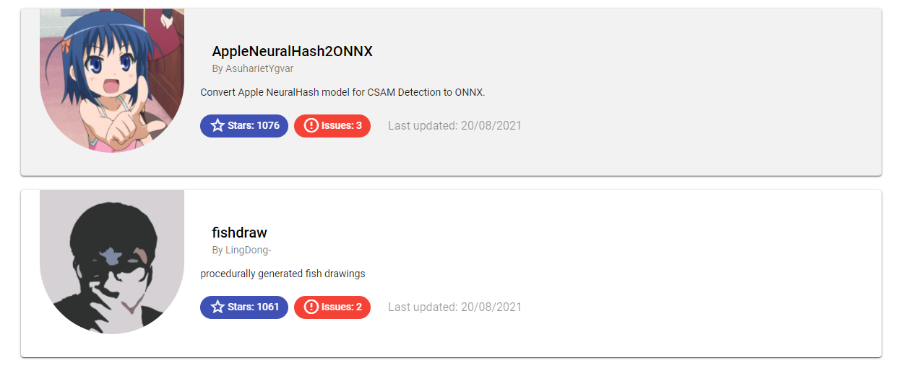

# MostStarredRepositories

Front-end app that regroups most starred repositories from 30 days ago. Here is a preview of the app below. 


This project was generated with [Angular CLI](https://github.com/angular/angular-cli) version 11.0.5.
In order to run it, you have to have it set up first.

## How to run 

Run `ng serve` for a dev server. Navigate to `http://localhost:4200/`. The app will automatically reload if you change any of the source files.

## Process of creation

After initializing the angular app I created a for loop that will take all repositories that the app is looking at. 

```html
<body>
  <div class="row" *ngFor="let repo of this.gitRepo">
    <!-- show a card for each repository in JSON -->
    <app-repository [repo] = repo></app-repository>
  </div>
<body>
```

the repositories are taken directly from the github api. For example, if we want to get the repositories from 2017-11-22 we will use the following address:

`https://api.github.com/search/repositories?q=created:>2017-10-22&sort=stars&order=desc`

So, in my case I had to have a flexible date that will keep changing depending on when the user uses the app. For instance, if I open the app now I will have the most starred repositories from the last 30 days. However, if I open the same app tomorrow it will be tomorrow's last 30 days. 

In order to achieve this result I just need to change the date inside with a different one that is being calculated each time the user open the app.

```javascript
//get current time and remove 30 days 
time = new Date(Date.now()-2628000000).toLocaleDateString().split("/");

//change to the format of the github api
date = this.time[2] + "-" + this.time[1] + "-" + this.time[0]; 
```

in this code I able to retrieve the date from 30 days compared to the `Date.now()`, in other terms, the current time. So, I can change the github api to the correct form which is:

`"https://api.github.com/search/repositories?q=created:%3E"+this.date+"&sort=stars&order=desc`

You might think that it is all, but in the github api we only get 30 repositories as of default and one page. Since, the JSON items we get are only one page from the 1000 items that are the maximum to get from the github api.

So, I had to create a loop that would get all the items, but getting all the items at once will just make the app really slow unecessarily. This is where the pagination comes in play. 

I created a pagination system that gets activated each time the user scrolls to the bottom of the page.

```javascript
@HostListener("window:scroll", ["$event"])
onWindowScroll() {
//get the position of the scrollbar and max scroll height
let pos = (document.documentElement.scrollTop || document.body.scrollTop) + document.documentElement.offsetHeight;
let max = document.documentElement.scrollHeight;
// pagination, add 30 each time scrollbar hits max
  if(pos == max && this.page < 34)   {
    this.page++;
    this.http.get("https://api.github.com/search/repositories?q=created:%3E"+this.date+"&sort=stars&order=desc&page="+this.page)
    .subscribe( data => {
      for(let i of data.items){
        this.gitRepo.push(i);
      }
    })
  }
}
```

I also added a new variable called `page` and changed the github api to `https://api.github.com/search/repositories?q=created:%3E"+this.date+"&sort=stars&order=desc&page="+this.page` so that the address becomes as flexible as possible.

In this code, each time the user hits the maximum scroll possible, the repository gets updated by 30 items that it gets from the new page that gets incremented and has data subscribed from it.

Having to scroll down will mean that the user will need to scroll back up at some point. I created in that case a button that brings him/her to the top of the page just by clicking on the bottom right button.
I also changed the `scroll-behavior` of the main css to have it scroll back up smoothly and not bring the user top in a split of a second, that wouldn't be comfortable to see.

That's it for the app component, now we can move to the repository cards.

I created as seen in the preview photo at the beginning of this file mat-cards that regroups all the information about each repository.

```html
<mat-card class="repo-card">
    <div fxLayout="row" fxLayoutAlign="start center" >
        <div fxFlex="20">
            
        </div> 
        <div>
            <mat-card-header>
                <mat-card-title><a [href]=repo.html_url style="text-decoration: none; color: black;">{{repo.name}}</a></mat-card-title>
                <mat-card-subtitle>By {{repo.owner.login}}</mat-card-subtitle>
            </mat-card-header>
            <mat-card-content>
                <p *ngIf="repo.description == null">
                    No description, website, or topics provided.
                </p>
                <p>
                    {{repo.description}}
                </p>
            </mat-card-content>

            <mat-chip-list>
                <mat-chip color="primary" selected><span class="icon"><mat-icon aria-hidden="false">star_border</mat-icon></span> Stars: {{repo.stargazers_count}}  </mat-chip>
                <mat-chip color="warn" selected><span class="icon"><mat-icon aria-hidden="false">error_outline</mat-icon></span> Issues: {{repo.open_issues_count}} </mat-chip>
                <p class="muted">Last updated: {{date}}</p>
            </mat-chip-list>
        </div>
    </div>
</mat-card>
```

I split the card into two columns using the [fxLayout](https://github.com/angular/flex-layout) library, one part for the user's icon, and the other one for his/her information.

I created it title using and **anchor** to redirect to the repository, just below it I indicated the name of the creator. Then, I showed the description of the repository, if none is written then I show *"No description, website, or topics provided."*. I used `mat-chips` to indicate the amount of stars and issues in a repository to have some colors and a good aspect overall. Just next to it, I showed the date of the latest update.

To make the front-end more alive, I added the hover effect that makes the card darken a little bit to show that the mouse is hovering over it and give an aspect of feedback to the user.



In this image above we can clearly see what card is being hovered.

>     This is the end of my documentation.
